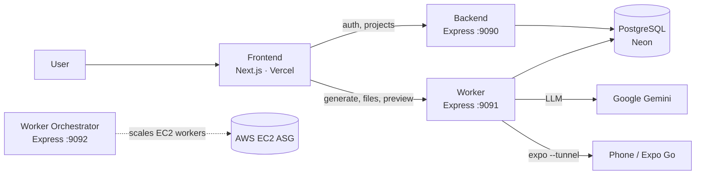

# App Forge

**Turn plain English into production-ready mobile apps.** Describe your idea and App
Forge generates clean, typed React Native (Expo) code that runs on iOS and Android —
from first prompt to a live preview you can open on your phone.

🔗 **Live:** [bolt-mobile-app-frontend.vercel.app](https://bolt-mobile-app-frontend.vercel.app)

---

## Features

- **Prompt → app.** Describe a mobile app in natural language; an LLM scaffolds the
  screens, navigation, and state as a real Expo project.
- **Live in-browser preview.** The generated app runs instantly in the browser via
  [WebContainers](https://webcontainers.io/) — no local setup.
- **Open on your phone.** A server-side `expo start --tunnel` session exposes a public
  `exp://` URL so you can open the app in Expo Go on any network.
- **Iterate by chat.** Follow-up prompts update the codebase; changes stream back live.
- **Editable code + export.** Browse the generated files, edit them, or download the
  project as a ZIP.
- **Auth built in.** User accounts and sessions via [Clerk](https://clerk.com).

## Tech Stack

| Layer      | Tech                                                          |
| ---------- | ------------------------------------------------------------ |
| Frontend   | Next.js 16 · React 19 · Tailwind · WebContainers · Clerk     |
| Backend    | Express · Bun · Clerk · Prisma                               |
| Worker     | Express · Bun · Google Gemini · Expo · ngrok tunnels         |
| Orchestrator | Express · Bun · AWS SDK (EC2 / Auto Scaling)               |
| Database   | PostgreSQL (Prisma ORM) — Neon in production                 |
| Monorepo   | Turborepo · Bun workspaces                                   |

## Architecture

App Forge is a Bun + Turborepo monorepo of four services plus a shared DB package:



| App / package              | Role                                                             | Port |
| -------------------------- | --------------------------------------------------------------- | ---- |
| `apps/frontend`            | Next.js UI — prompt input, code view, WebContainer preview      | 3000 |
| `apps/backend`             | REST API — projects, prompts, actions; Clerk-verified           | 9090 |
| `apps/worker`              | Runs LLM generation, writes the project, hosts the Expo tunnel  | 9091 |
| `apps/worker-orchestrator` | Optional — provisions/scales EC2 worker instances on AWS        | 9092 |
| `packages/db`              | Prisma schema + generated client (`@bolt/db`)                   | —    |

> **Concurrency note.** The worker is single-tenant by design: it keeps one global Expo
> tunnel and one workspace directory. The `worker-orchestrator` exists to give each user
> their own worker instance on AWS. Running a single shared worker (e.g. the free-tier
> deploy) serves **one active build/preview session at a time**.

## Quick Start

Requires [Bun](https://bun.sh) `>= 1.3.14` and a PostgreSQL database.

```bash
git clone https://github.com/gyana-rj/bolt-mobile-app.git
cd bolt-mobile-app
bun install

# start a local Postgres (or use Neon / Supabase)
docker run -e POSTGRES_PASSWORD=mysecretpassword -e POSTGRES_DB=bolty_db -d -p 5432:5432 postgres

# set up .env files (see CONTRIBUTING.md), then:
bun run --filter @bolt/db db:generate
bun run --filter @bolt/db db:migrate

bun run dev
```

Full setup, environment variables, and Docker / Docker Compose instructions are in
**[CONTRIBUTING.md](./CONTRIBUTING.md)**.

## Deployment

The app runs on free tiers with the AWS orchestrator disabled:

- **Frontend** → Vercel (Next.js, native build)
- **Backend + Worker** → Render (Docker web services)
- **Database** → Neon (Postgres)
- **Auth** → Clerk

Step-by-step deploy instructions and env vars are in **[DEPLOY.md](./DEPLOY.md)**.

## Scripts

| Command                                  | Description                          |
| ---------------------------------------- | ------------------------------------ |
| `bun run dev`                            | Run all apps in watch mode (Turbo)   |
| `bun run build`                          | Build all apps                       |
| `bun run lint`                           | Lint all packages                    |
| `bun run check-types`                    | Type-check all packages              |
| `bun run --filter @bolt/db db:studio`    | Open Prisma Studio                   |
| `bun run --filter @bolt/db db:migrate`   | Create / apply a migration           |

## Contributing

Contributions are welcome — see **[CONTRIBUTING.md](./CONTRIBUTING.md)** for setup and
guidelines. Branch off `main`, run `bun run lint` and `bun run check-types`, and open a PR.
